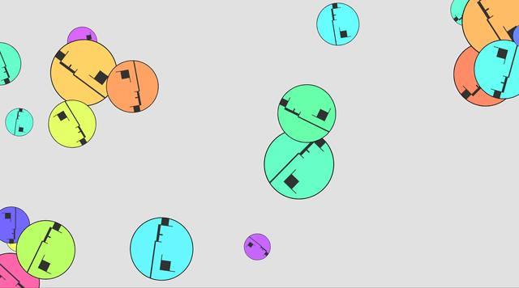

# Creative coding major project
My Creative coding major project for IDEA9103
## Instructions on how to interact with the work

**1.Click the number “1” on the keyboard and the pattern on the screen will move in a randomized trajectory.**
- You cannot use '2,3,4' before using the '1' function since it will become a static effect after applying other dynamic functions.
- Recommended order ‘0/5~1~Other’ or ‘1~Other’.
- It is preferable to use '1' before '2, 3, 5', and there is no order constraint on '0, 5' in the stationary state.

*Click “1” again to pause the track movement.*
*At this point, the mouse clicks on which circle is selected will move with the mouse. Clicking the circle again will uncheck it.*

**2.Click the number “2” on the keyboard and the pattern on the screen will move from left to right.**

*Click “1” again to pause the track movement.*
*At this point, the mouse clicks on which circle is selected will move with the mouse. Clicking the circle again will uncheck it.*

**3.Click the number “3” on the keyboard and the pattern on the screen will move from right to left.**

*Click “1” again to pause the track movement.*
*At this point, the mouse clicks on which circle is selected will move with the mouse. Clicking the circle again will uncheck it.*

**4.Click on the number “4” on the keyboard, the pattern in the screen will be gathered to the mouse position, and after gathering, it will be dispersed and move freely.**
- Each press of ‘4’ will update the mouse position and the concentric circles will move towards the updated mouse position. Try pressing ‘4’ more than once.
- When using the ‘1,2,3,5’ function, you can also press ‘4’ and the concentric circles will move towards the mouse position.
*Click “1” again to pause the track movement.*
*At this point, the mouse clicks on which circle is selected will move with the mouse. Clicking the circle again will uncheck it.*

**5.Click the number “5” on the keyboard and the pattern on the screen will change size randomly.**

 - If you click “5” directly, the screen pattern will be static, but if you press “5” continuously, the screen will keep changing in size.
 - If the operation “1, 2, 3” is performed, the screen will continue the previous dynamic trajectory and the size of the circle will change.
 - If you click “0” and then “5” after clicking “1, 2, 3”, the screen resumes the static circle change.

*Click “1” again to pause the track movement.*
*At this point, the mouse clicks on which circle is selected will move with the mouse. Clicking the circle again will uncheck it.*

**6.Click the number “0” on the keyboard to initialize the canvas, refresh it to the initial state, and keep clicking for random color changes to occur.**

*Notes：*
- *After clicking “1, 2, 3, 4” dynamic operation, and then click “1” the screen will be in a static state, at this time again click “1” to restore the dynamic.*
- *When running the “1,2,3” operation, some circles may be stuck at the edge of the canvas, just drag them to the center with the mouse and they will not be stuck anymore.*
- *Each function key can be used crosswise for unexpected effects, and it's fun to use them individually.*

## Details of your individual approach to animating the group code.
###  Interaction
### Which properties of the image will be animated and how
- Setting up the movement of the whole circle, concentric circles moving together.
- Added motion trajectories, concentric circles moving from left to right, and right to left, random motion.It bounces back when it hits the edge.
- The size of the concentric circles is set to vary randomly.
- Mouse interaction is set up, mouse clicks on the concentric circles, the concentric circles move with it.   

### Inspiration

[link text](http://www.complexification.net/gallery/machines/nodeGarden/)

- According to the random position and size of the circle in the picture think about the “1” “5” function, concentric circles randomly moving and concentric circles randomly changing size, so that the picture is richer.

[link text](https://canvas.sydney.edu.au/courses/56592/pages/week-7-lecture?module_item_id=2258226)

- According to the picture, when the circle touches the edge and bounces back, the concentric circle will bounce back when it touches the edge of the canvas when the motion “1,2,3,4” is set.

[link text](https://canvas.sydney.edu.au/courses/56592/pages/week-9-tutorial-2?module_item_id=2312769)

- The “2, 3” function is set to move concentric circles from left to right within the canvas according to the diagram.

[link text](https://canvas.sydney.edu.au/courses/56592/pages/week-6-lecture-2?module_item_id=2258222)

- According to the figure mouse click pattern following, set up to click on the concentric circles, concentric circles move with the mouse.

### Technical explanation
#### Added keyboard interactions with keys (1, 2, 3, 4, 5, 0) to achieve different interactions such as stop/start movement, scroll right/left, re-initialize circle, move towards mouse position and randomly change circle size.
function keyPressed() { ... }
- "1":If the value of 'isMoving' is 'true', this variable is used to control the graph's moving state; otherwise, it is 'false'. ' had a value of "false", it becomes "true". This variable is used to regulate the graphic's movement, either starting or stopping.

- "2":Use the ‘for’ loop to give each circle a speed of 5.5 to the right horizontally, and then control the movement of the graphic by ‘isMoving’, and finally run the function.

- "0":Reinitialize the circle array, then apply the 'draw' method again to draw the circle, then stop the graphic movement using 'no loop & is Moving'.

- "3":Use the 'for' loop to give the circle a horizontal speed of 10 to the left, then control the graphic's movement using 'isMoving', and finally start the animation.

- "4": Determine each circle with 'for', then use 'atan2' to compute the angle between the target circle c and the mouse point. The obtained angle is then used to apply a horizontal velocity of 'x,y' to the target circle via the'sin.cos' function. Finally, apply the function to start the animation.

-"5":The ‘for’ loop is used to determine each circle, then the function randomly generates the diameter of the circle, and finally redraws the circle.

*You can customize the circle size and speed values.*

#### Added mouse click, mouse release drag and drop functionality.
##### function mouseClicked() {...}
-Check if concentric circles have been selected
If selectedCircleIndex is not equal to -1, it means that a circle is already selected.
Calculates the distance d from the mouse to the center of the circle.
If the distance is less than the circle radius (the click is inside the circle), deselect and turn off the drag function.

- Check if another concentric circle is clicked
Calculate the distance d
If the distance is less than the radius of the circle (the click is inside the circle), then check to enable dragging

##### function mouseReleased() {...}
- Stop dragging when the mouse is released.

##### Modified function draw
- Added two functions to update the position of each circle for collision detection and bounce handling.

##### Modified function drawRedLine and function drawGoldZShape
- Delete “let innerAngle = angle + angleStep / 2;”
“let innerRadiusAdjust = fourthRadius + (thirdRadius - fourthRadius) * 0.3;”
If don't delete it, the animation display will be problematic

##### Modified function fillDotsOnCircle function
- The modified dots are randomly distributed so that the dots can move randomly when the “1,2,3,4” button is clicked to execute the motion trajectory.

##### Mouse clicked & Mouse released
- The final update assigns the 'Mouse clicked, Mouse released' operations to a 'class'. 
- I also inserted a mouse click event in the 'function setup' to ensure that the function is executed correctly.

#### WindowResized
- Finally added the ability to adapt the prototype to the window interface
- First, resize the canvas, then initialize the circle, and finally draw it.